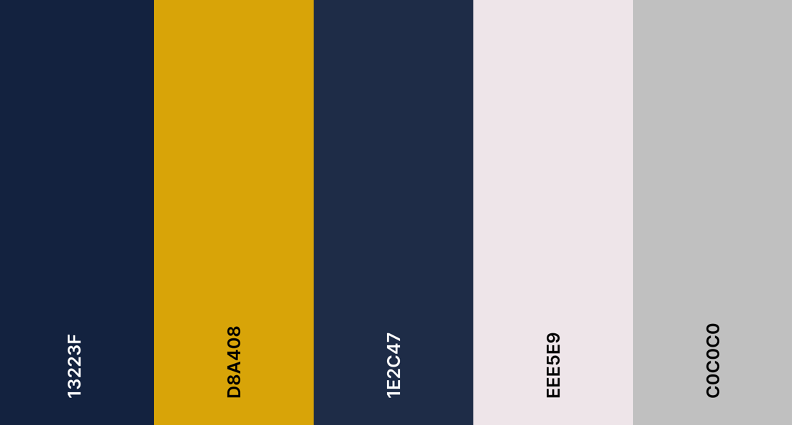
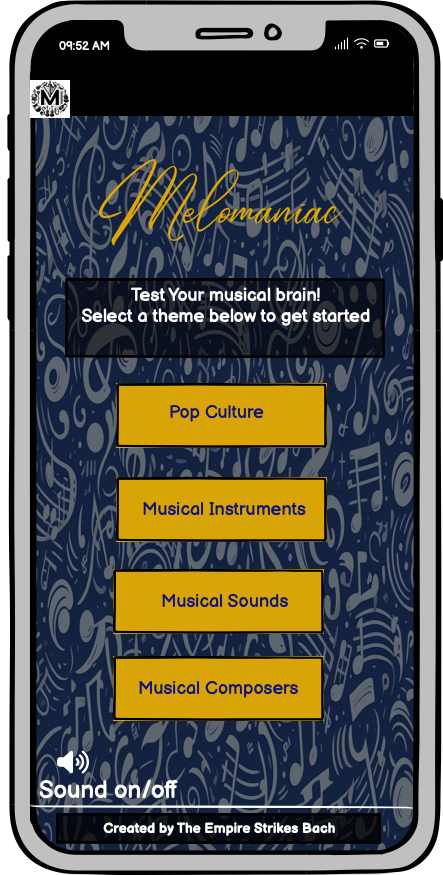
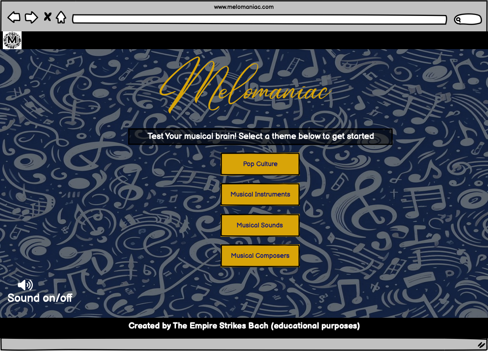
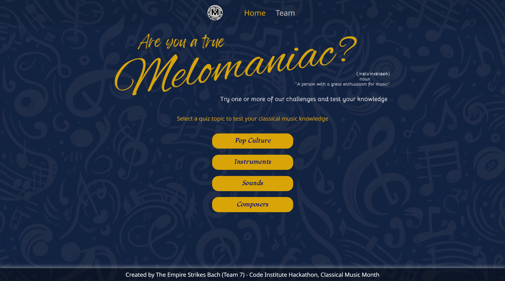
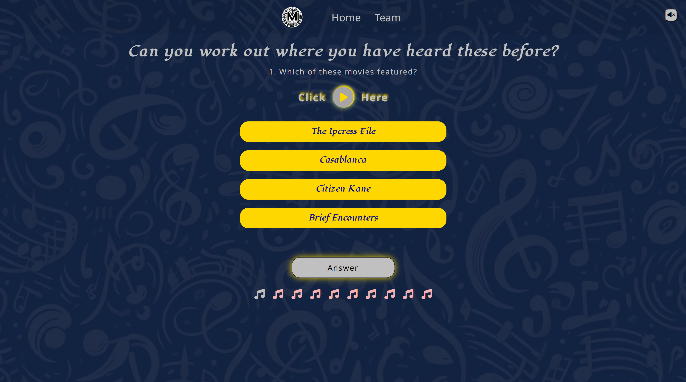

# [Melomaniac](https://md-ash-dot.github.io/classical-music-hackathon/)

=======

## Introduction
The Empire Strikes Bach Musical Quiz App is an interactive, educational tool designed to engage users with a variety of questions that explore musical knowledge. With a focus on different categories like instrument identification, sound recognition, and pop culture references, this app has the potential to cater to a wide range of audiences—from students learning about music theory to casual users interested in testing their musical knowledge. The site can be accessed through the [link](https://md-ash-dot.github.io/classical-music-hackathon/)

## Content

-   [Introduction](#introduction)
-   [UX](#ux)
    -   [Colour Scheme](#colour-scheme)
    -   [Typography](#typography)
-   [User Stories](#user-stories)
-   [Wireframes](#wireframes)
-   [Features](#features)
-   [Tools & Technologies Used](#tools--technologies-used)
-   [Collaborators](#Collaborators)
-   [Testing](#testing)
-   [Agile Development Process](#agile-development-process)
-   [Deployment](#Deployment)
-   [Credits](#credits)

## UX

### User Experience

The Empire Strikes Bach musical quiz app is essential for creating an engaging, intuitive, and enjoyable interaction that keeps users returning for more. The UX design will focus on simplicity, engagement, accessibility, and a smooth flow from question to question. Below is a breakdown of the key UX elements for the app.

**The Ideal User**
- It ensure that first-time users understand the app's features and how to navigate through it without feeling overwhelmed.
- It provide a clear navigation and quick access to different quiz categories for any users.
- It Offers a clean, focused environment that makes answering questions fun and engaging.
- The APP Keep users motivated by making the quiz more interactive and competitive.
- Ensure a high-quality, smooth audio experience for sound-based questions for users.
- Make the app usable for a broad audience, including those with different accessibility needs.
- Maintain a fluid and logical flow through the app to minimize confusion and frustration.
-  Encourage users to continue engaging with the app after completing quizzes.
- Ensure a consistent experience across devices and platforms for users.
- Allow users to provide feedback easily.

**Site Goals**
- To provide a fun, interactive learning experience that enhances users’ musical knowledge.
- To keep users engaged and motivated to return to the site regularly.
-  Ensure the site is easy to navigate, intuitive, and offers a positive user experience.
- To attract a broad audience by providing a mix of educational and entertaining content.

### Colour Scheme
We've used CSS for the colours and used colours from the original strike Bach App to make it feel authentic.

we've used [coolors.co](https://coolors.co/13223f-d8a408-1e2c47-eee5e9-c0c0c0) to generate our colour palette.

## Typography

 - Lugrasimo google font was used as the main font of the website in order to increase readability of the content on the pages.

 

## User Stories

### Landing Page 

- As a user, I should be able to figure out what a site is about in 10 seconds.

### Wireframes

To follow best practices, wireframes were developed to help with development.
We've used [Balsamiq](https://balsamiq.com/wireframes) to design our site wireframes.

**Sections:**

| Mobile Page | Desktop Page | Musical Quiz Page |
| --- | --- | --- |
|  |  |  |

| Team Page | Quiz Page |
| --- | --- |
|  | 

[Back to top](#Melomaniac)

## Features

- **Main Page**

  - The main page of this musical quiz app is designed to allow users to test their knowledge across various categories of music. Users are welcomed with a clean, interactive interface, where they can select from four quiz options: Pop Culture, Musical Instruments, Instrument Sounds, and Composers. Each option is represented by an icon, making it visually appealing and easy to navigate. The page also provides links to a team page and displays the app's logo.

  It’s user-friendly, inviting music lovers to engage with fun trivia games while learning more about different musical genres and elements.

  

- **Pop Culture Page**

  - The Pop Culture option in the musical quiz app tests your knowledge of music as it relates to popular culture. This quiz likely covers questions about famous soundtracks, iconic songs, popular artists, and musical trends from movies, TV shows, and other entertainment media. It's a fun way to challenge your understanding of how music has influenced and been featured in mainstream culture. 

   

- **Musical Instrument Page**

  - The Musical Instruments option in the quiz app focuses on testing your knowledge of different musical instruments. This quiz may include questions about various types of instruments, their characteristics, how they're played, and their role in different genres of music. It's a great way to challenge your understanding of the world of instruments, from classical to modern.

  

- **Instrument Sound Page**  
    
  - The Instrument Sounds option in the quiz app challenges users to identify different musical instruments based on the sounds they produce. It includes audio clips of various instruments, and users must recognize and match the sound to the correct instrument. This quiz sharpens your ear for music and helps improve your ability to distinguish between different instrument sounds.

   

- **Composers Page**    

  - The Composers option in the quiz app tests your knowledge of famous composers and their works. It includes questions about well-known classical and modern composers, their musical styles, and their most iconic pieces. This quiz is perfect for those interested in learning more about the creators behind some of the greatest music in history.

  
   

- **Team Page** 

  - The Team page introduces the developers and creators behind the musical quiz app. It provides information about the team members, their roles, and contributions to the project. This page highlights the collaborative effort and expertise that went into building the app, giving users insight into the people who made the experience possible.

   

- **Navbar** 

  -  The Navbar of the page provides easy navigation for users. It includes a logo for the musical quiz app and links to the Home and Team pages. The Home link is marked as the current page, while the Team link allows users to learn more about the creators of the app. The Navbar ensures quick access to key sections of the site, making it user-friendly and straightforward.   

   

 - **Logo**

   - The logo represent the symbol and favicon used on the website.

   
 
  - **Footer**

    - The Footer of the page credits the development team, named "The Empire Strikes Bach (Team 7)," and mentions that the app was created during a Code Institute Hackathon in celebration of Classical Music Month. It serves as a closing note, acknowledging the creators and the event behind the app's development.

     

- **Images and Background**

We have included the following images and background in the project:

| Image | Screenshot |
| --- | --- |
| About Title |  |
| Title |  |
| Ripped Sheet |  |
| Tones |  |
| Homepage Logo |  |
| Page Background | 
| Music |  |

[Back to top](#Melomaniac)

## Tools & Technologies Used

-  used for version control. (`git add`, `git commit`, `git push`)
-  used for secure online code storage.
-  used as a cloud-based IDE for development.
-  used as a local IDE for development.
-  used for the main site content.
-  used for the main site design and layout.
-  used for user interaction on the site.
-  used for creating wireframes.
-  used for creating the App Logo.
-  used for creating Audio.
-  used for creating Information.
-  used for asking questions.
-  used to trim audio size.

[Back to top](#Melomaniac)

## Collaborators

We would like to extend our sincere gratitude to the talented team of developers who contributed their time, expertise, and creativity to the creation of our musical quiz app. This project would not have been possible without the collaborative efforts and dedication of each member. Their technical skills, innovative problem-solving, and passion for music and technology have been integral to the success of this app.

Thank you for your invaluable contributions and commitment to excellence.

| Team Member | Role | GitHub |
| --- | --- | --- |
| Gemma | UI/UX designer extraordinaire | [Github](https://github.com/GemmaButcher-dev) |
| Iryna | JavaScript master | [GitHub](https://github.com/irasan) |
| James | Jack of all trades | [Github](https://github.com/broken-helix) |
| Martins | The master of The README | [Github](https://github.com/Ebuka-martins) |
| Muhammed | Scrum Lead, Deployment, Project Setup, Epics, Agile | [Github](https://github.com/md-ash-dot/) |
| Maria | Jack of all trades | [Github](https://github.com/maria-grozova) |
| Kiree |  Jack of all trades | [Github](https://github.com/Swewi) |

[Back to top](#Melomaniac)

### Testing

## Agile Development Process

**Agile Methodology**

Our project uses Agile methodology, a framework that enables us to create an interactive, multimedia-based musical quiz app that engages users through learning and entertainment, covering instrument identification, sound recognition, and pop culture music trivia.

- Objectives:

  - Build a platform for sound-based and visual quizzes.
  - Ensure a seamless user experience with responsive design.
  - Develop a scalable app that can integrate new features over time.
  - Deliver the project in iterations, incorporating feedback continuously.

- Core Agile Team

  - **Development Team:** A cross-functional team that includes front-end and back-end developers, UI/UX designers, QA testers, and DevOps engineers. 
  - **Scrum Master:** Facilitates the Agile process, ensuring the team follows Agile principles and removes any roadblocks that hinder progress. 
  - **Team Members (TM):** Responsible for defining the vision and managing the product backlog. The TM ensures that the app aligns with the overall business goals.

At the start of each sprint, our team engages in sprint planning to set the direction for our upcoming work, involving prioritization of the product backlog to address the most critical tasks first, defining clear sprint goals aligned with project milestones, and assigning tasks based on expertise and workload. Throughout development, we navigate trade-offs between scope, quality, time, and resources to maintain a balance between delivering high-quality work efficiently and managing priorities. Adopting Agile methodologies allows us to remain adaptable and focused, ensuring we meet user needs while striving for excellence.

- Conclusion

  This Agile methodology provides a clear, flexible, and iterative approach to building our musical quiz app. By delivering features incrementally, regularly reviewing feedback, and making adjustments as needed, it ensure that the app meets user expectations, stays aligned with business goals, and continuously improves over time.

Through this process, user stories, issues, and tasks were planned, then tracked on a daily basis using [MIRO APP](https://miro.com/app/board/uXjVLdWR2kA=/)

**GitHub Issues**

[GitHub Issues](https://github.com/md-ash-dot/classical-music-hackathon) served as an Agile tool.

It also helped with iterations on a daily basis.

screen shots of open and closed issues here

**Collaboration Tools** 

The team used Slack where we had two or three meetings per day and to message in for quick collaboration purposes and Github projects to track ideas, User Stories, Bugs and Time plan.

The Team used Slack team channel Canvas to ensure everyone stayed updated on project progress and discussions.

[Back to top](#Melomaniac)
   

## Deployment

The live deployed application can be found deployed on [github-pages](https://md-ash-dot.github.io/classical-music-hackathon/).

### Deployment to GitHub Pages

This project was deployed on GitHub pages using the following steps:

- From the project's repository, go to the settings tab.

- From the left-hand-menu, select the pages tab.

- Select the Main branch from under the Source section dropdown and click Save.

- After a few minutes, a message will display to indicate a successful deployment and provide a Live link.

### Local Deployment

**GitHub**

First a new repository was created in github then this project can be cloned or forked in order to make a local copy on your own system.

Once the project is cloned or forked, in order to run it locally you will need to use the command 'npm run start' to start the app.

**Version Control**

For version control the following steps were made:

- If any changes were made to the Gitpod or VS Code project.

- First files were made ready for commit with command - 'git add filename or git add .' second option to add all files.

- To commit the changes using the following command - git commit -m "This is my commit" Note the brief description at the end of the command to make you aware of what changes have occurred.

- To then move the changes to GitHub, use the following command - git push your branch name.

- Create a pull request in GitHub which another member can then approve.

**Cloning**

You can clone the repository by following these steps:

- Navigate to the repository you choose to clone in your GitHub.

- Clicking on the arrow of the green button named "Code" at the top of the file.

- Then select "Local" then under local select "HTTPS" and then copy that URL.

- Navigate to your code editor and within the terminal change the directory to the location you wish to clone the repository to.

- Type "git clone" and paste the copied HTTPS link from GitHub.

- Press enter and git will clone the repository to your local machine.

Alternatively, if using Gitpod, you can click below to create your own workspace using this repository.

**Forking**

By forking the GitHub Repository, we make a copy of the original repository on our GitHub account to view and/or make changes without affecting the original owner's repository. You can fork this repository by using the following steps:

- Log in to GitHub and locate the GitHub Repository.

- At the top of the Repository (not top of page) just above the "Settings" Button on the menu, locate the "Fork" Button.

- Click the create button, once clicked, you should now have a copy of the original repository in your own GitHub account!

[Back to top](#Melomaniac)

### Credits
